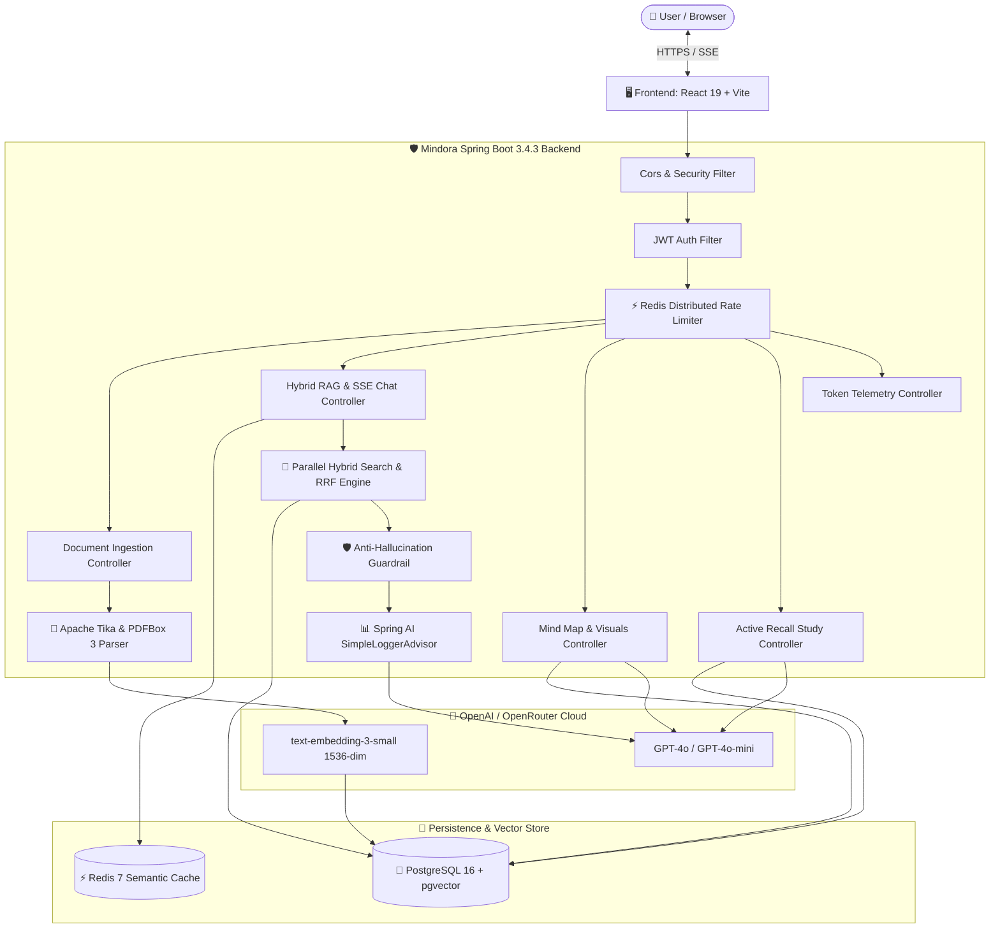
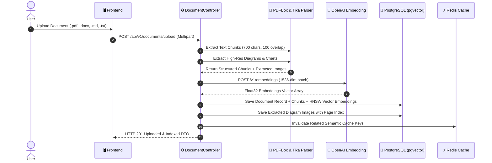
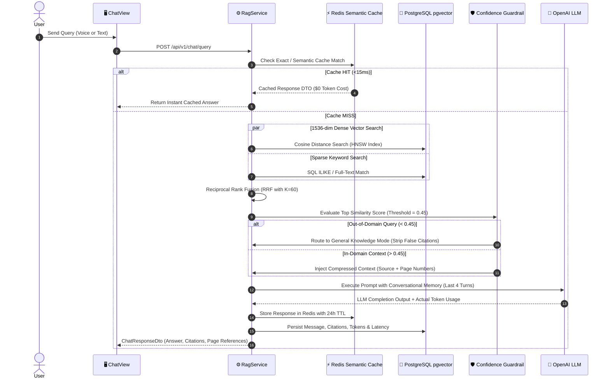
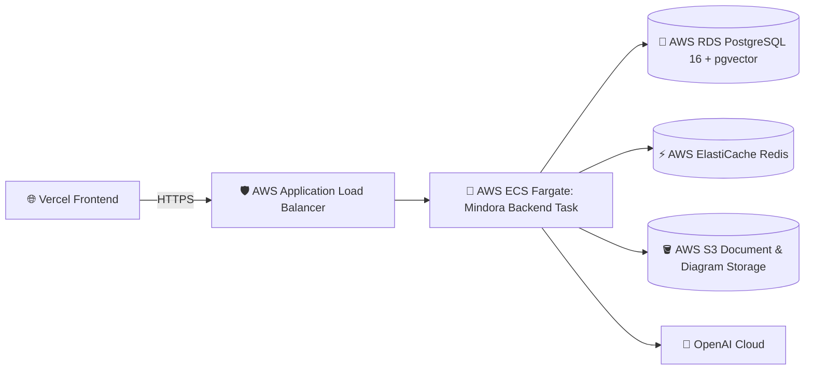

# 🧠 Mindora — System Architecture & Deployment Blueprint

---

## 🌟 1. System Overview & Core Philosophy

**Mindora** is an enterprise multi-modal **Retrieval-Augmented Generation (RAG)** platform designed for document intelligence, hybrid vector search, anti-hallucination safety, interactive knowledge graphs, and real-time AI study acceleration.

```
       ┌────────────────────────────────────────────────────────┐
       │                Client Layer (Web / Mobile)             │
       │           React 19 + TypeScript + Vite + Tailwind      │
       └───────────────────────────┬────────────────────────────┘
                                   │ HTTPS / WSS / SSE
                                   ▼
       ┌────────────────────────────────────────────────────────┐
       │             API Gateway & Security Layer               │
       │       Spring Security 6 + JWT + Distributed Rate Limit │
       └───────────────────────────┬────────────────────────────┘
                                   │
              ┌────────────────────┴────────────────────┐
              ▼                                         ▼
┌───────────────────────────┐             ┌───────────────────────────┐
│     Core RAG & Chat       │             │   Multi-Modal & Study     │
│  Parallel Hybrid RRF      │             │  Diagram Extraction       │
│  Anti-Hallucination Guard │             │  Interactive Mind Map     │
│  Context Compressor       │             │  Active Recall Study Hub  │
└─────────────┬─────────────┘             └─────────────┬─────────────┘
              │                                         │
              └────────────────────┬────────────────────┘
                                   │
    ┌──────────────────────────────┼──────────────────────────────┐
    ▼                              ▼                              ▼
┌──────────────────────┐ ┌──────────────────────┐ ┌──────────────────────┐
│  PostgreSQL 16 DB    │ │  Redis 7 Cache Layer │ │   AI Foundation      │
│  pgvector (HNSW)     │ │  Semantic Query Cache│ │   OpenAI GPT-4o-mini │
│  Relational Entities │ │  Token Bucket Limiter│ │   Embedding-3-small  │
└──────────────────────┘ └──────────────────────┘ └──────────────────────┘
```

---

## 🏗️ 2. High-Level Architecture Flowchart



---

## 🔄 3. Core Execution Pipelines

### 3.1 📄 Document Ingestion, Diagram Extraction & Vector Indexing Pipeline



---

### 3.2 🔀 Parallel Hybrid Search & RRF Merging Pipeline

Mindora executes semantic vector search and exact keyword matching concurrently on separate worker threads using `CompletableFuture.allOf`:



---

## 🗄️ 4. Database Schema & Data Models

```
┌───────────────────────────┐         ┌───────────────────────────┐
│         users             │         │        documents          │
├───────────────────────────┤         ├───────────────────────────┤
│ id: UUID (PK)             │1       *│ id: UUID (PK)             │
│ email: VARCHAR (Unique)   ├─────────┤ user_id: UUID (FK)        │
│ password: VARCHAR         │         │ filename: VARCHAR         │
│ name: VARCHAR             │         │ file_size: BIGINT         │
│ created_at: TIMESTAMP     │         │ content_type: VARCHAR     │
└─────────────┬─────────────┘         │ is_indexed: BOOLEAN       │
              │                       └─────────────┬─────────────┘
              │1                                    │1
              │                                     │
              │*                                    │*
┌─────────────┴─────────────┐         ┌─────────────┴─────────────┐
│      conversations        │         │      vector_store         │
├───────────────────────────┤         ├───────────────────────────┤
│ id: UUID (PK)             │1        │ id: UUID (PK)             │
│ user_id: UUID (FK)        │         │ document_id: UUID (FK)    │
│ title: VARCHAR            │         │ content: TEXT             │
│ message_count: INT        │         │ metadata: JSONB           │
│ created_at: TIMESTAMP     │         │ embedding: VECTOR(1536)   │
└─────────────┬─────────────┘         └───────────────────────────┘
              │1
              │
              │*
┌─────────────┴─────────────┐         ┌───────────────────────────┐
│      chat_messages        │         │    token_usage_events     │
├───────────────────────────┤         ├───────────────────────────┤
│ id: UUID (PK)             │         │ id: UUID (PK)             │
│ conversation_id: UUID(FK) │         │ user_id: UUID (FK)        │
│ question: TEXT            │         │ category: VARCHAR         │
│ answer: TEXT              │         │ prompt_tokens: INT        │
│ similarity_score: FLOAT   │         │ completion_tokens: INT    │
│ prompt_tokens: INT        │         │ total_tokens: INT         │
│ completion_tokens: INT    │         │ created_at: TIMESTAMP     │
│ total_tokens: INT         │         └───────────────────────────┘
│ created_at: TIMESTAMP     │
└───────────────────────────┘
```

---

## 🚀 5. Comprehensive Deployment Blueprint

### 5.1 🌐 Frontend Deployment on Vercel

The React 19 + TypeScript frontend is already equipped with [`vercel.json`](file:///Users/deepakkumarsingh/Desktop/Mindora-Rag-project/frontend/docmind-frontend/vercel.json) for Single Page Application (SPA) deep linking and route rewrites.

#### Steps to Deploy Frontend to Vercel:
1. Push code to GitHub:
   ```bash
   git push origin main
   ```
2. In the [Vercel Dashboard](https://vercel.com):
   * Click **"Add New Project"** and import your repository.
   * **Root Directory**: `frontend/docmind-frontend`
   * **Framework Preset**: `Vite`
   * **Build Command**: `npm run build`
   * **Output Directory**: `dist`
3. **Environment Variables on Vercel**:
   | Variable | Value | Description |
   | :--- | :--- | :--- |
   | `VITE_API_BASE_URL` | `https://your-backend-domain.com` | Production URL of your Spring Boot backend (without trailing slash) |

---

### 5.2 ⚙️ Backend Deployment Options (Pros, Cons & Architecture)

| Deployment Option | Best For | Estimated Monthly Cost | Complexity | Managed pgvector Support |
| :--- | :--- | :--- | :--- | :--- |
| **Option A: Railway / Render** *(Recommended)* | Startup, MVP, Full-Stack Showcase | Free / $5 – $15 | ⭐ Very Low | ✅ Built-in 1-Click |
| **Option B: AWS ECS Fargate + RDS PostgreSQL** | Enterprise Production, Compliance, Scale | $35 – $90+ | ⭐⭐⭐ High | ✅ AWS RDS Postgres 16 |
| **Option C: DigitalOcean App Platform / GCP Cloud Run** | Predictable Pricing, Serverless Containers | $10 – $25 | ⭐⭐ Moderate | ✅ Supabase / Neon Addon |

---

#### 🌟 Option A: Deploy Backend on Railway / Render (Fastest & Simplest)

1. **Database & Cache Setup**:
   * Add a **PostgreSQL** service in Railway or Render.
   * Enable `pgvector` extension via SQL console:
     ```sql
     CREATE EXTENSION IF NOT EXISTS vector;
     ```
   * Add a **Redis** service in Railway or Upstash Redis.
2. **Backend Container Deployment**:
   * Connect your GitHub repo to Railway / Render.
   * It will automatically detect the root [`Dockerfile`](file:///Users/deepakkumarsingh/Desktop/Mindora-Rag-project/Dockerfile).
3. **Environment Variables**:
   ```ini
   SPRING_PROFILES_ACTIVE=prod
   PORT=9081
   DB_HOST=<postgres-host>
   DB_PORT=5432
   DB_NAME=<postgres-db-name>
   DB_USER=<postgres-user>
   DB_PASSWORD=<postgres-password>
   SPRING_DATA_REDIS_HOST=<redis-host>
   SPRING_DATA_REDIS_PORT=6379
   SPRING_DATA_REDIS_PASSWORD=<redis-password>
   SPRING_AI_OPENAI_API_KEY=<your-openai-or-openrouter-key>
   SPRING_AI_OPENAI_BASE_URL=https://openrouter.ai/api/v1
   APP_CORS_ALLOWED_ORIGINS=https://your-frontend.vercel.app,http://localhost:3000
   ```

---

#### 🏢 Option B: Deploy on AWS (Enterprise High-Availability Architecture)



1. **Database**: AWS RDS PostgreSQL 16.2+ (native `pgvector` extension support).
2. **Cache**: AWS ElastiCache for Redis (or Upstash Serverless).
3. **Compute**: AWS ECS Fargate container running the Docker image with Auto-Scaling (1–4 tasks).
4. **Networking**: AWS Route 53 with ACM SSL Certificate on Application Load Balancer (ALB).

---

## 🔒 6. Security, CORS & Production Checklist

- [x] **CORS Configuration**: Allow origin `https://your-frontend.vercel.app` with `allowCredentials=true`.
- [x] **SSL / HTTPS Termination**: Enforced on Vercel and Backend Load Balancer.
- [x] **JWT Security**: Secret keys injected via environment variables (`JWT_SECRET`).
- [x] **Rate Limiting**: Distributed Redis Token Bucket prevents DoS / API key drainage.
- [x] **Memory Management**: JVM configured with `-XX:+UseG1GC -XX:MaxRAMPercentage=75.0`.
- [x] **Zero Guesswork Tokens**: Spring AI `SimpleLoggerAdvisor` and `ChatResponse` usage metadata.
